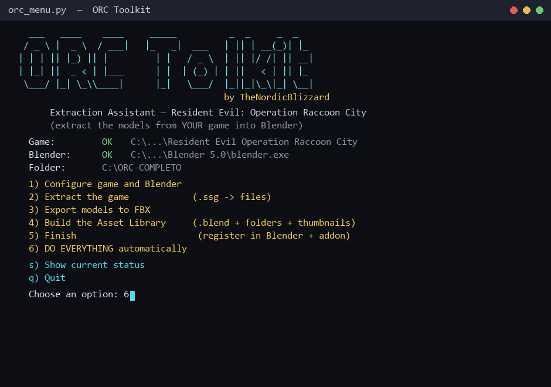

# RE: Operation Raccoon City — Model Extraction Toolkit

A **tested, complete** pipeline to extract models from
*Resident Evil: Operation Raccoon City* (**Hexane Engine**, by Slant Six Games)
and bring them into **Blender** — including skeletons, textures, and a browsable
**Asset Library** organized by category.

> ⚠️ **This repository contains NO game assets.** Only scripts and documentation.
> You need the game installed to extract your own files.
> Models/textures are © CAPCOM / Slant Six Games — **personal use only**.

**Languages:** English (this file) · [Português (BR)](README.pt-BR.md)

---

## What this toolkit does

```
Game (.ssg)  →  [extract]  →  loose files  →  [import in Blender]  →  FBX / Asset Library
```

| Step | Script | Result |
|------|--------|--------|
| 1. Unpack `.ssg` | `01_ssg_extract.py` | Tree with all `.edgemodel`, `.matb`, `.dds` |
| 2. Asset index | `02_build_index.py` | JSON for fast texture resolution |
| 3. Import into Blender | `03_orc_import_blender.py` | Mesh + skeleton + materials |
| 4. Export FBX | `04_export_all_models.py` | FBX by category (characters/weapons/vfx/worlds) |
| 5. Asset Library | `05`–`10` | Single `.blend`, catalogs, thumbnails, previews |
| 6. Final touches | `11`–`15` | Light/heavy versions, centering, fixes |

**Reference result:** 2,144 `.ssg` → 113,829 files; 2,337 models in the
library (Characters / Enemies / Weapons / VFX / Props), with 0 failures.

---

## Requirements

- **Windows** (scripts assume Windows paths; adapt if needed)
- **Python 3.10+** (for extraction)
- **Blender 3.x / 4.x / 5.x** (compatible with all — see the section below)
- The **game** *RE: Operation Raccoon City* installed

Optional (recommended): [ORCToolKit](https://github.com/PiMoNFeeD/ORCToolKit) (MIT),
PiMoNFeeD's GUI tool — handy for inspecting `.ssg` files manually.

---

## Installation

```bash
git clone https://github.com/TheNordicBlizzard/orc-toolkit.git
cd orc-toolkit
```

---

## Quick start (interactive assistant)

The easiest way: run the **menu** and follow the options.

```bash
python orc_menu.py
```

> 📖 **New to this?** See **[INSTALL.md](INSTALL.md)** — a full walkthrough
> from scratch, with images.



```
   1) Configure game and Blender     <- auto-detects
   2) Extract the game               (.ssg -> files)
   3) Export models to FBX
   4) Build the Asset Library        (.blend + folders + thumbnails)
   5) Finish                         (register in Blender + addon)
   6) DO EVERYTHING automatically    <- runs 2->5 at once
   s) Show current status
   q) Quit
```

The menu **detects** your game and Blender automatically, saves the config to
`orc_config.json`, and shows progress for each step. Great if you'd rather not
touch the command line.

### Blender version compatibility

The toolkit works on **Blender 3.x, 4.x and 5.x**. Version differences are
handled automatically (see `scripts/_compat.py`):

| Change between versions | How it's handled |
|-------------------------|------------------|
| EEVEE engine (`BLENDER_EEVEE` vs `BLENDER_EEVEE_NEXT`) | `_compat.eevee_engine()` tries both |
| Transparency (`blend_method` → `surface_render_method` in 4.2+) | `_compat.set_material_alpha()` |
| `orphans_purge` (signature changed) | `_compat.purge_orphans()` |
| Addon folder (`.../Blender/<version>/...`) | `orc_menu.addon_dir_for()` detects the version |
| Custom normals (crash on 4.1+/5.x) | `_compat.set_custom_normals()` validates first |

> The menu reads the Blender version via `blender --version` and uses the right paths.

---

## Manual use (command line)

If you'd rather run each step by hand, see **[docs/PIPELINE.md](docs/PIPELINE.md)**.
Summary:

```bash
set GAME=<game folder>
set WORK=<work folder>

python scripts/01_ssg_extract.py "%GAME%" "%WORK%\ssg_unpacked"
python scripts/02_build_index.py "%WORK%\ssg_unpacked" "%WORK%\_asset_index.json"
```

And so on (full order in the docs).

---

## Scripts

| File | Description |
|------|-------------|
| `orc_menu.py` | **Interactive assistant** (menu) — best place to start |
| `scripts/_compat.py` | Blender version compatibility layer |
| `scripts/01_ssg_extract.py` | Unpacks **all** `.ssg` (v5/v6, zlib, resumable) |
| `scripts/01b_ssg_extract_single.py` | Unpacks a **single** `.ssg` |
| `scripts/02_build_index.py` | Builds a JSON asset index |
| `scripts/03_orc_import_blender.py` | Imports `.edgemodel` into Blender (PiMoNFeeD, MIT; 3.x–5.x) |
| `scripts/04_export_all_models.py` | Exports all models to FBX by category |
| `scripts/04b_export_characters_fbx.py` | Alternative: one Blender process per character |
| `scripts/04c_batch_export.py` | Processes a batch of models (used by 04) |
| `scripts/04d_import_one.py` | Imports one model and exports FBX (used by 04b) |
| `scripts/05_build_chunks.py` | Builds the library in chunks (avoids memory crash) |
| `scripts/06_build_library.py` | Imports FBX → library `.blend` |
| `scripts/07_merge_library.py` | Merges the parts into a single `.blend` |
| `scripts/08_convert_to_collections.py` | Objects → **collection assets** (full drag) |
| `scripts/09_gen_thumbnails.py` | Generates 320×320 thumbnails |
| `scripts/10_apply_previews.py` | Applies thumbnails as asset previews |
| `scripts/11_organize_catalogs.py` | Organizes into catalogs (Characters/Enemies/Props...) |
| `scripts/12_make_versions.py` | Creates no-props and props-only versions |
| `scripts/13_fix_center_bones.py` | Centers models + makes bones visible |
| `scripts/14_fix_degenerate_alpha.py` | Fixes degenerate alpha (transparency) |
| `scripts/15_register_library.py` | Registers the library in Blender |
| `addon/orc_asset_helper.py` | Addon: makes assets editable when dragged |

Environment variables: `ORC_TEXDIR` (textures folder),
`ORC_LIBDIR` (library folder), `ORC_BLENDER` (Blender path),
`ORC_IMPORTER` (importer), `ORC_ASSET_INDEX_FILE`, `ORC_ASSET_ROOT`.

---

## Documentation

- **[INSTALL.md](INSTALL.md)** — full step-by-step guide (from scratch)
- **[docs/PIPELINE.md](docs/PIPELINE.md)** — complete pipeline order, with every command
- **[docs/FORMAT.md](docs/FORMAT.md)** — the `.ssg` and `.edgemodel` formats (Hexane Engine)
- **[docs/TROUBLESHOOTING.md](docs/TROUBLESHOOTING.md)** — common errors and fixes
- **[docs/SHARE.md](docs/SHARE.md)** — ready-to-use promo posts
---

## Credits

- **[PiMoNFeeD](https://github.com/PiMoNFeeD/ORCToolKit)** — ORCToolKit + the original
  Blender import script (MIT). Foundation of the whole importer.
- **Szkaradek123** — original script on the Xentax forum (from which PiMoNFeeD's derived).
- This toolkit — the extraction pipeline, library builder, and automation.

## License

The scripts in this repository are under **MIT** (see `LICENSE`).
`03_orc_import_blender.py` derives from PiMoNFeeD's work (MIT) — credits preserved.

**Game assets:** © CAPCOM / Slant Six Games. Do not redistribute. Use only with
your own copy of the game, for personal/educational purposes.
